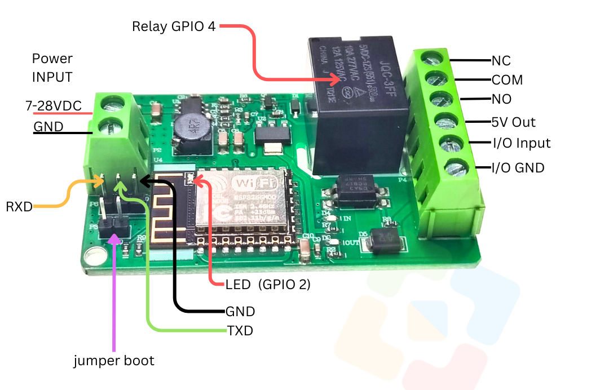

# Modul ESP8266 ESP-12f Relay 1 Channel 


## Persiapan di Arduino

1. **Instal Arduino IDE**: Jika belum menginstal, unduh dan instal Arduino IDE dari website resmi Arduino.

2. **Tambahkan Board ESP8266 ke Arduino IDE**:

   - Buka **Arduino IDE**.

   - Pergi ke menu **File** → **Preferences**.

   - Di bagian 

     Additional Board Manager URLs, masukkan URL berikut:

     ```bash
     http://arduino.esp8266.com/stable/package_esp8266com_index.json
     ```

   - Klik **OK**.

   - Buka menu **Tools** → **Board** → **Boards Manager**.

   - Cari **ESP8266** dan instal paket yang ditampilkan.

3. **Pilih Board ESP8266**:

   - Pergi ke menu **Tools** → **Board**, lalu pilih board yang sesuai, seperti **NodeMCU 1.0 (ESP-12E Module)** atau board ESP8266 yang Anda gunakan.

4. **Pilih Port yang Tepat**:

   - Sambungkan ESP8266 ke komputer menggunakan kabel USB.
   - Pergi ke menu **Tools** → **Port** dan pilih port yang sesuai dengan ESP8266 Anda.


## Testing Relay

1. **Buat Sketsa Baru**:

   - Buka Arduino IDE, klik **File** → **New** untuk membuat sketsa baru.

2. Ketik Kode 

   ```c++
   #include <Arduino.h>
   
   // Definisikan pin LED
   #define LED_PIN1 2
   #define LED_PIN2 4
   
   void setup() {
     // Atur kedua pin sebagai output
     pinMode(LED_ESP, OUTPUT);
     pinMode(RLY1, OUTPUT);
   }
   
   void loop() {
     // Nyalakan LED pada pin GPIO2 dan matikan LED pada pin GPIO4
     digitalWrite(LED_ESP, HIGH);
     digitalWrite(RLY1, LOW);
     delay(1000); // Tunggu selama 1 detik
   
     // Matikan LED pada pin GPIO2 dan nyalakan LED pada pin GPIO4
     digitalWrite(LED_ESP, LOW);
     digitalWrite(RLY1, HIGH);
     delay(1000); // Tunggu selama 1 detik
   }
   ```

3. **Simpan Sketsa**:

   - Simpan sketsa dengan nama seperti `testing-relay.ino`.


## Cara download

- Pasang serial USB TTL dengan ketentuan RX -> TX USB Serial ; TX -> RX USB Serial; GND -> GND USB Serial
- Pasang 5V ke VCC 5V USB serial
- Pasang Jumper ke IO0 dan GND
- Pasang USB serial ke komputer
- Tekan dan lepas tombo reset dengan jumper tetap terpasang ke IO0 dan GND
- Download program 
- Lepas jumper
- Tekan dan lepas tombol reset untuk run-program
- Ulang langkah awal untuk download ulang